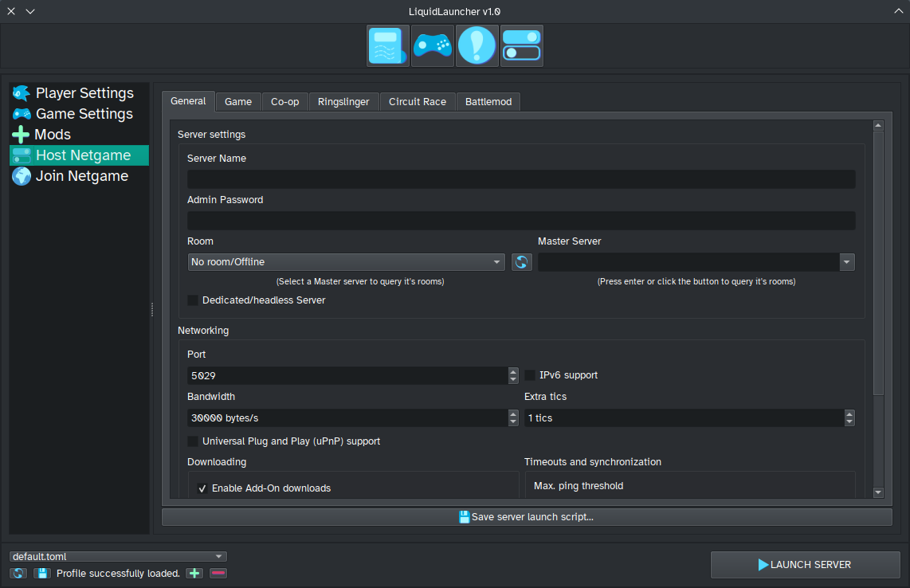
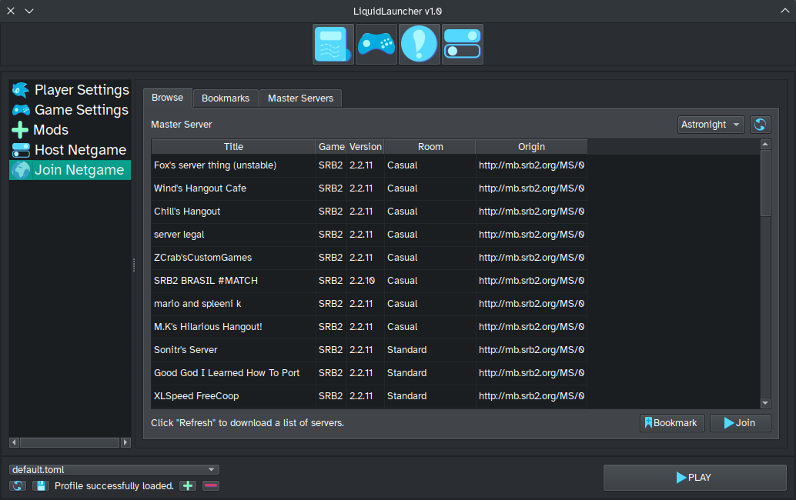

LiquidLauncher
==============

Features
--------

### What game options? ALL OF THEM.

LiquidLauncher seeks to be the ultimate launcher for SRB2 and as such we
strive to provide every game setting we can possibly find right to your
fingertips. LiquidLauncher currently supports **OVER 100+ GAME OPTIONS** to
adjust your netgames exactly how you wish,
**including dedicated first-class support for Battlemod**!

On Linux, LiquidLauncher also supports launching SRB2 through *both WINE and
Flatpak* installations.

### Profiles and scripts

Wanna quickly set-up multiple netgames in one go? LiquidLauncher supports
**live-swappable profiles** so you'll never have to remember your settings
again. All settings are also saved in an easy-to-edit TOML format for easy
adjustment and sharing.

Wanna share your configs with non-LiquidLauncher players? Wanna host your
LiquidLauncher config on a dedicated server?  Simply **export your settings
as a launch script** for both Windows and \*nix shell formats, *available
for both client and server setups*.

### Built-in Netgame browser

Although based on LauncherBlast2-reBoot, we completely overhauled our
netgame browser to provide a comfortable netgaming experience. Join active
netgames directly from LiquidLauncher, manage bookmarks of any netgames you
like, and because we're Liquid of course, we've also made sure you can do
so for any master server you can find, **including native support for [LiquidMS].**

[LiquidMS]: <https://github.com/zibonbadi/liquidms>

### Built-in Mod browser

Mod downloads disabled? Just use the **integrated mod browser**
to download mods from all across the SRB2 community and have them **added
to your profile in one click**.

(**DISCLAIMER**: Due to possible quality control concerns on behalf of the
official SRB2 Message Board, only the official forum is enabled by default.
Player discretion is advised.)

### Fully featured RSS/Atom newsreader

Keep up with the latest news from Liquid, SRB2, the wider Sonic community
or **literally any RSS feed you can find.** Seriously, just add your own
feed in the settings and you can browse news from all across the internet,
right from within LiquidLauncher.

Installation
------------

### Windows

Simply put `LiquidLauncher.exe` into your SRB2 directory. This should make sure
that all commands run by LiquidLauncher point to the right files.

#### A note on antivirus

Many modern antivirus solutions check against a database of known file
hashes, which can lead to false positives for lesser-known homebrew
projects such as this.

Of course, we'd like you to verify our launcher using another antivirus
scan such as [VirusTotal], but unless there's been a middleman inbetween
you and the GitHub servers (which HTTPS should prevent), our executables
contain no malware and should be safe to execute. Please don't run them as
administrator though, it's not necessary.

[VirusTotal]: <https://www.virustotal.com>

### Linux

Just run it. Linux usually installs the game globally and resolves file lookup
itself, so it doesn't matter.

If you run the Flatpak version... send us your issues and we'll seek to fix
them :3

### Building for developers

[PyInstaller] is already included in our `requirements.txt` simply install it
into your (virtual) environment and run the following command:

[PyInstaller]: <https://pypi.org/project/pyinstaller/>

   user$ pyinstaller ll_main.py --icon=img/icons/ll.ico --onefile --windowed

CONTRIBUTING
------------

Here's a quick breakdown of our tools:

### Python

LiquidLauncher is written in Python. In order to start developing
LiquidLauncher, we recommend using our make recipe:

    user$ make init

Alternatively, you can also manually [set up a virtual environment][PyVEnv].

[PyVEnv]: <https://docs.python.org/3/library/venv.html>

    user$ python3 -m venv /path/to/new/virtual/environment

After that's done, install the necessary packages into there.

    user$ pip install -r requirements.txt

In order to run your development builds, use Python 3:

    user$ python3 ll_main.py

### Qt UI and Resources

The graphical interface is done using Qt Designer. To generate a compiled
Python BLOB, simply run the respective Qt compilers:

    user$ pyside6-uic ll.ui -o ll_ui.py
    user$ pyside6-rcc ll.qrc -o ll_rc.py

Alternatively, we've also supplied Make recipies to do this:

    user$ make ll_ui.py
    user$ make ll_rc.py

Due to Qt requirements, resource images are to be included in PNG format.
For editing, please use SVG if you can (this will future-proof the graphics).  
Icons are rendered/exported with a standard height of 64px.

`default.html` is a resource to be included in `ll.qrc`. It provides the
initial page for the RSS browser.

### Distributable builds

Distributable builds are done using [PyInstaller] and we prefer one-file
builds for easy distribution. Here's the command to do it.

    user$ pyinstaller ll_main.py --icon=img/icons/ll.ico --onefile --windowed

We also defined a `make` recipe for your convenience:

    user$ make dist

What are all those files?
-------------------------

On first launch, LiquidLauncher will create a few config files to help. These
are largely in TOML format and should be fairly easy to exchange and edit.

`ll_profiles/default.toml`
: A default game profile. You can create additonal profiles under `Game -> Profiles`

`settings.toml`
: Global settings. This includes your current profile, available profiles, mod
sources (also your RSS feeds someday) and your currently selected Master Server

`netgames.toml`
: Your bookmarked netgames.

`masterservers.toml`
: Your saved master servers. By default, these are filled in with the official

  STJr and Kart Krew master servers.

Special Thanks
--------------

Special thanks to HitCoder9768's for building the base of this project,
[LauncherBlast2-reBoot](https://github.com/HitCoder9768/LauncherBlast2-reBoot).
